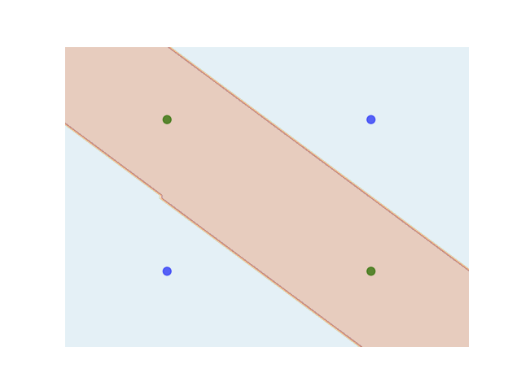
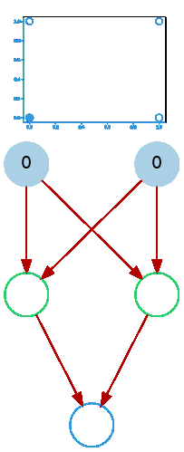
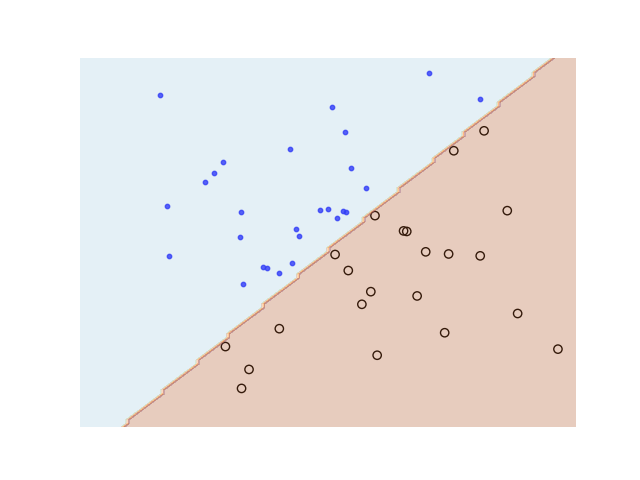

# Kviz

[](http://www.apache.org/licenses/LICENSE-2.0.html)


Visualization library for Keras Neural Networks

## Examples

### Architecture Visualization

```python
    model = keras.models.Sequential()
    model.add(layers.Dense(2, input_dim=2))
    model.add(layers.Dense(1, activation="sigmoid"))
    model.compile(loss="binary_crossentropy")

    dg = DenseGraph(model)
    dg.render()
```

Produces the following graph:

<p align="center">
    
</p>

### Node Activation Visualization

#### XOR Function

```python
    model = keras.models.Sequential()
    model.add(layers.Dense(3, input_dim=2, activation='sigmoid'))
    model.add(layers.Dense(1, activation='sigmoid'))
    model.compile(loss="binary_crossentropy")

    X = np.array([
        [0,0],
        [0,1],
        [1,0],
        [1,1]])
    Y = np.array([x[0]^x[1] for x in X]) # Xor function

    history = model.fit(X, Y, batch_size=4, epochs=1000)

    dg = DenseGraph(model)
    dg.render(X)
```

Produces the following decision boundary (visualized using `matplotlib`):

<p align="center">
    
</p>

And the following GIF:

<p align="center">
    
</p>

The darker the node the higher the activation is at that node.

#### Linear Decisions Boundary

```python
    import sklearn.datasets as datasets

    model = keras.models.Sequential()
    model.add(layers.Dense(3, input_dim=2, activation=ACTIVATION))
    model.add(layers.Dense(1, activation=ACTIVATION))
    model.compile(loss="binary_crossentropy")

    centers = [[.5, .5]]
    t, _ = datasets.make_blobs(n_samples=50, centers=centers, cluster_std=.1)
    X = np.array(t)
    Y = np.array([1 if x[0] - x[1] >= 0 else 0 for x in X])

    history = model.fit(X, Y)

    dg = DenseGraph(model)
    dg.render(X, duration=.3)
```

Produces the following decision boundary (visualized using `matplotlib`):

<p align="center">
    
</p>

And the following GIF:

<p align="center">
    
</p>

At a glance you can see that the activations of the middle hidden node
results in predictions of class 0 while the activation of the left-most
and right-most hiddent nodes result in predictions of class 1.
