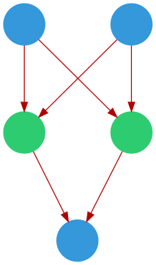

# Kviz

Visualization library for Keras Neural Networks

## Example

```python
    model = keras.models.Sequential()
    model.add(layers.Dense(2, input_dim=2))
    model.add(layers.Dense(1, activation="sigmoid"))
    model.compile(loss="binary_crossentropy")

    dg = DenseGraph(model)
    dg.render()
```

Produces the following graph:

<p align="center">
    
</p>
